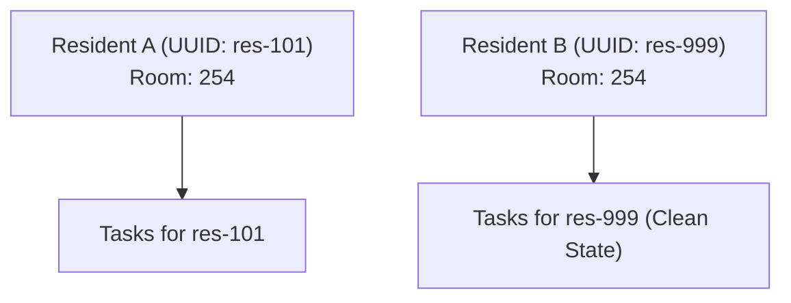

# TASKSHEET — DATA ARCHITECTURE SPECIFICATION
**Local-First Persistence, Room Reuse Isolation & Provenance**
*Developed by SoftVibeSolutions*

---

## 1. Immutable Identity & Relationships

TaskSheet uses RFC 4122 v4 UUIDs for entity keys:
- `resident_id`: Permanent unique key.
- `shift_id`, `role_id`: Relational keys.
- `task_id`, `unit_task_id`, `wound_id`, `fyi_id`, `completion_id`.

**Never use Room Numbers, Shift Names, or Role Codes as primary keys.**

---

## 2. Room Reuse Safety Invariant

When Resident A is discharged or relocated, their tasks and history remain strictly linked to `res-101`. When Resident B later moves into Room 254, Resident B receives **zero bleed** of tasks, wounds, or historical completions.

---

## 3. Data Provenance & Safe Demo Data Separation

All operational records include a `source` tag:
- `manual`: Created by facility staff.
- `imported`: Loaded via external data file.
- `demo`: Disposable fictional test record.

**Clear Demo Data** purges only records with `source === 'demo'`. The **Standard Task Catalog**, facility profile, and custom shifts are strictly preserved.

---

## 4. Local-First Offline Storage & Backup Engine

- **Persistence Layer**: Browser `localStorage` / `IndexedDB` with full reactive subscription.
- **Backup Format**: Standard JSON schema containing Facility, Settings, Roles, Shifts, Residents, Tasks, Unit Tasks, FYIs, Wounds, and Completions.
- **Restore Validation**: Pre-validates schema integrity before committing to live storage.
