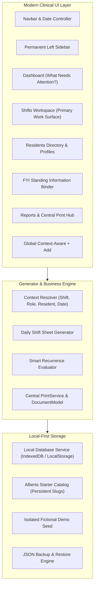

# TASKSHEET — MASTER APPLICATION ARCHITECTURE
**Daily Role Assignment & Task Sheet Generator**
*Developed by SoftVibeSolutions*

---

## 1. Product Philosophy & Core Tenet

> **TASKSHEET IS A GENERATOR — NOT A DATABASE MANAGER**

Traditional clinical management systems overburden staff with raw relational tables, foreign keys, complex recurrence rules, and repetitive form prompts. TaskSheet inverts this paradigm:

```
INPUT WHAT NEEDS TO HAPPEN
          ↓
TASKSHEET UNDERSTANDS CONTEXT
          ↓
TASKSHEET ORGANIZES IT
          ↓
TASKSHEET GENERATES THE SHIFT
          ↓
VIEW / COMPLETE / PRINT
```

TaskSheet asks only the minimum questions necessary to create work assignments, automatically inheriting Date, Shift, Role, and Resident contexts.

---

## 2. System Architecture



---

## 3. Core Entities & Relational Rules

1. **Facility Profile**:
   - `siteName`, `street`, `addressLine2`, `city`, `province`, `postalCode`, `mainPhone`, `unitPhone`, `fax`.
   - Never hardcoded; dynamically populates all print headers.

2. **Roles & Shifts**:
   - Roles: Immutable UUID, name, code (`HCA`, `LPN`, `RN`, `SUP`), default print profile (`simple_checklist` vs `clinical_worksheet`).
   - Shifts: Immutable UUID, `roleId`, name (`LPN Day`, `HCA Day`, `Overnight`), `startTime` (`0700`), `endTime` (`1900`). Cross-midnight is auto-inferred from start/end military times.

3. **Residents (with Strict Room-Reuse Isolation)**:
   - Identifiers: `id` (UUID), `firstName`, `lastName`, `roomNumber`, `status` (`active`, `in_hospital`, `out_on_pass`, `discharged`, `deceased`, `inactive`).
   - **Privacy Rule**: No DOB or health numbers stored.
   - **Room Reuse Guarantee**: Room is a display location, not identity. If Resident A moves out of Room 254 and Resident B occupies Room 254, Resident B receives zero bleed of tasks, wounds, or notes.

4. **Resident Tasks & Unit Tasks**:
   - `ResidentTask`: Requires `residentId`. Scheduled for specific shift or role.
   - `UnitTask`: Pertains to shift routines (Start, During, End) — e.g. fridge temperature, narcotic count, handoff. Never uses fake residents like "Unit".

5. **FYI (Standing Information)**:
   - Non-actionable information staff must know (preferences, safety alerts, protocols).
   - Tracked in the FYI Binder with physical sync tracking (`Binder Current` vs `Binder Update Required`).

6. **Central PrintService**:
   - Shared `PrintDocumentModel` powering both on-screen preview and physical `@media print` paper rendering. Clean blank checkboxes (`☐`) for shift workers.

---

## 4. Technology Stack & Packaging

- **Frontend Core**: Vite + React 18 + TypeScript
- **Styling**: Modern Clinical Operations Theme with Tailwind CSS v4, Inter typography, tabular numerals.
- **Icons**: Lucide React
- **Offline / Persistence**: Local-first IndexedDB / LocalStorage, installable PWA ready.
- **Testing**: Vitest (Unit/Integration) + Playwright (End-to-End User Journeys).
